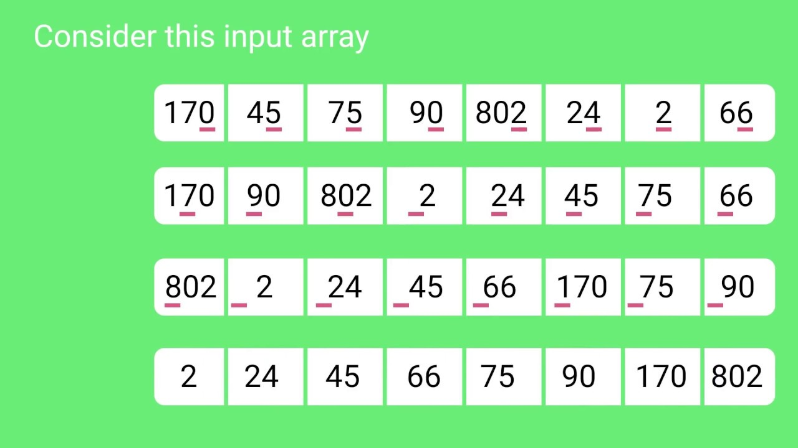

# Ordenação de Placas de Identificação Veicular
A ideia do problema era ler um arquivo de texto, por meio do programa, contendo uma lista de Placas desordenadas e organizá-las em ordem lexicográfica.

## Para a solução, a minha abordagem utilizou 4 arquivos
1. Um contendo uma classe do tipo "plate" (plates.py), utilizada para guardar as placas como um mesmo objeto.
2. Outro arquivo contendo a classe cVector (platesDatabase.py), que é responsável por armazenar todos os objetos "placa" em um mesmo "container" (que só pode receber objetos dessa mesma classe).
3. O arquivo contendo o algorítmo de ordenação utilizado. Nesse caso, o Radix Sort (falaremos mais sobre ele).
4. O main.py, que lê, diretamente da linha de comando, o arquivo de texto a ser ordenado, conta o tempo de execução do programa, cria um arquivo com nome sorted_plates.txt contendo o resultado da ordenação e imprime o tempo de execução do programa (apenas a nível de curiosidade).

## Radix Sort
Dada a natureza do problema, com placas de tamanho fixo, e a ideia de conceber um algorítmo que tivesse complexidade menor que `O(n.log(n))`, o Radix Sort me pareceu uma escolha direta. O algorítmo não possui um método muito complicado de implementação e ao deixarmos de lado as comparações (focando apenas nos dígitos que compõem cada elemento) o algorítmo traz uma abordagem linear, dependendo apenas do número de elementos e da quantidade de dígitos que cada objeto possui. Além disso, ele tem a possibilidade de ser paralelizado, como em [1].

### A ideia por trás do algorítmo
O Radix Sort implementa um Counting Sort para cada dígto de cada palavra da lista a ser ordenada. Para que fique mais claro, usarei o problema das placas como próprio exemplo. Tomando que sabemos que todas as placas têm tamanho 7 (ou seja, são 7 dígitos que as compõem), então o que vamos fazer é olhar para cada um de seus dígitos por vez, guardar a informação de quantas vezes esse valor se repetiu (armazenando essa informação em uma lista auxiliar) e em seguida, com base nessa informação, conseguimos determinar quem possui os menores dígitos e esses por sua vez vêm na frente da lista a ser retornada (já que queremos em ordem lexicográfica). O exemplo abaixo pode ajudar a visualizar melhor:

Figura 1 - Exemplo do funcionamento do Radix Sort

A complexidade do algorítmo, portanto, está diretamente ligada com a quantidade dígitos, e para cada dígito temos que percorrer a lista toda, analisando o valor do dígito correspondete de cada "objeto". Em outras palavras, para esse caso, percorremos `n` posições (número de elementos) `k` vezes (número de dígitos dos elementos). O que nos deixa com uma complexidade `O(k.n)`, que é da ordem de grandeza `O(n)`, mas vale ressaltar que se o número de dígitos for igual a quantidade de elementos, o algorítmo passa a ser `O(n²)` [2].

# Referências Bibliográficas:

[1] N. Satish, M. Harris, and M. Garland. **Designing efficient sorting algorithms for manycore GPUs**. NVIDIA Technical Report NVR-2008-001, September 2008. Disponível em: https://mgarland.org/files/papers/nvr-2008-001.pdf

[2] Simplilearn. **What Is Radix sort Algorithm: Pseudocode, Time Complexity, C Program & More**. Lesson 27 of 55,
Last updated on Mar 28, 2022. Disponível em: https://www.simplilearn.com/tutorials/data-structure-tutorial/radix-sort
